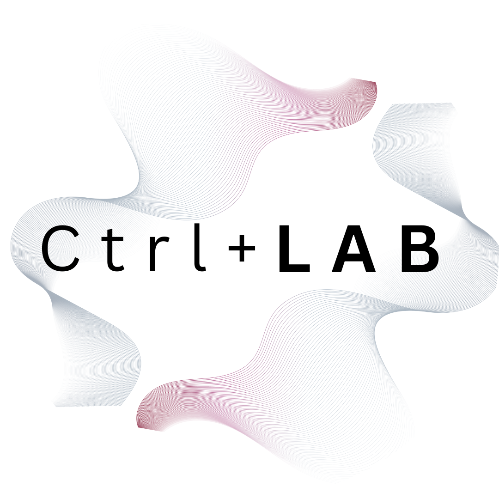
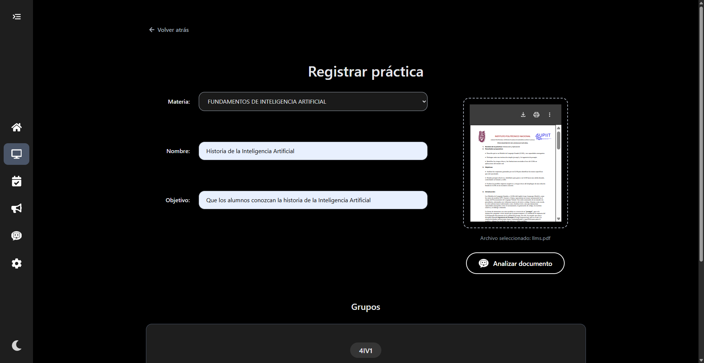
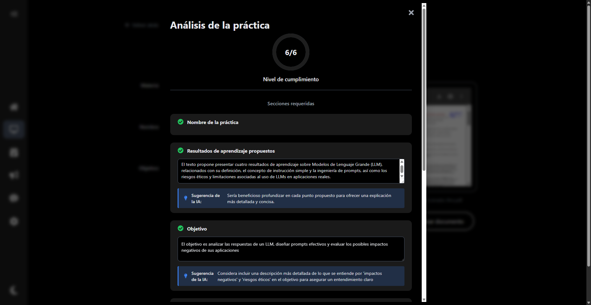

<br/>
<p align="center">
  <h1 align="center">Ctrl + LAB</h1>

  <p align="center">
    An Intelligent Computer Lab Management System with an AI-Powered Assistant.
    <br />
  </p>
</p>

<!-- TECHNOLOGY BADGES -->
<p align="center">
  
  
  
  
  
  
  
</p>

<p align="center">
  &nbsp;&nbsp;&nbsp;&nbsp;&nbsp;&nbsp;
  &nbsp;&nbsp;&nbsp;&nbsp;&nbsp;&nbsp;
  
</p>

### **Introduction**

**Ctrl + LAB** is a full-stack web application designed to streamline the management of academic laboratories. While optimized for **computer labs**, its flexible architecture allows for easy adaptation to manage resources for any type of practical session, including **chemistry, biology, or physics labs**. It empowers teachers with an intuitive platform to define their **weekly schedules, upload and manage academic practices, and dynamically book lab sessions for their student groups**. The entire experience is **fully responsive**, ensuring seamless access across desktops, tablets, and mobile devices.

The system provides real-time room availability, preventing scheduling conflicts before they happen. Through a centralized dashboard, teachers can view a countdown to their **next practice**, track their **monthly progress** against teaching goals, and stay informed with a live activity log. Meanwhile, administrators gain access to a powerful control panel offering complete system oversight. This includes full management of teacher accounts and lab resources, and the ability to **export historical data** for offline analysis, institutional reporting, and record-keeping.

The standout feature of Ctrl + LAB is **"Controly,"** an **AI assistant** integrated directly into the platform. Powered by a hybrid Retrieval--Augmented Generation (RAG) architecture, Controly allows teachers to interact conversationally, asking simple questions about their personal schedules, registered practices, and institutional data to receive instant, accurate, and context-aware answers.

This project is fully containerized with Docker, ensuring easy setup, portability, and a consistent development environment across all systems.

<p align="center">
  
</p>

### **Table of Contents**

1.  [Key Features](#key-features)
2.  [Technology Stack](#technology-stack)
3.  [Project Structure](#project-structure)
4.  [Database](#database)
5.  [Application](#application)
    - [Landing Page](#1-landing-page)
    - [Sign Up (Onboarding)](#2-sign-up-onboarding)
    - [Log In & Authentication](#3-log-in--authentication)
    - [Home Dashboard](#4-home-dashboard)
    - [Teacher Workspace](#5-teacher-workspace)
    - [Lab Status Monitoring](#6-lab-status-monitoring)
    - [Announcements](#7-announcements)
    - [AI Assistant "Controly"](#8-ai-assistant-controly)
    - [Administration Panel](#9-administration-panel)
6.  [Getting Started](#getting-started)
7.  [Usage](#usage)
8.  [License](#license)

---

### **Key Features**

The application is packed with features designed to provide a seamless and powerful experience for both teachers and administrators.

#### **General & Platform-Wide**

- **Fully Responsive Design:** The entire user interface is built to be fully responsive, providing a consistent and intuitive experience on desktops, tablets, and mobile devices.
- **Role-Based Access Control:** A secure system with two distinct user roles:
  - **Teacher:** Access to all personal scheduling, booking, and material management features.
  - **Administrator:** Full control over all users and system resources, in addition to teacher privileges.
- **Secure Authentication:** User accounts are protected with password hashing (Bcrypt) and JSON Web Token (JWT) based authentication system for secure session management.
- **Bilingual Support (i18n):** The entire frontend, along with backend-generated emails and AI responses, is fully translated to support both **English** and **Spanish**.
- **Light & Dark Mode:** A modern theming system allows users to switch between a light or dark interface for optimal viewing comfort.

#### **For Teachers**

- **Comprehensive Onboarding:** A guided, one-time setup process where new teachers can define their entire academic profile, including their subjects, student groups, and recurring weekly schedules with specific `CLASS` and `PRACTICE` time slots.
- **Centralized Home Dashboard:** A "mission control" view that provides at-a-glance information:
  - **Countdown Timer:** A live countdown to the next scheduled lab practice.
  - **Personal Calendar:** An interactive calendar showing all upcoming and past lab sessions.
  - **Activity Log:** A real-time feed of the teacher's most recent actions (e.g., "registered a new practice," "deleted a practice").
  - **Gamified Performance Tracking:** A position card that ranks the teacher based on the number of completed lab sessions, encouraging active system use.
- **Dynamic Lab Booking:** An intelligent scheduling system that:
  - Checks for real-time room availability for a given date and time.
  - Prevents scheduling conflicts with other teachers or with a group's own existing schedule.
- **Practice & Materials Management:** Full CRUD (Create, Read, Update, Delete) functionality for academic practices, allowing teachers to upload, manage, and version-control their lab documents (PDFs).
- **Real-time Lab Status View:** A dedicated page to monitor the daily schedule of all available lab rooms, showing a timeline of busy and free slots.

#### **For Administrators**

- **Complete Teacher Management:** Admins have a dedicated panel to oversee all teacher accounts, including:
  - Viewing a comprehensive profile for any teacher, including their schedules, subjects, and all registered practices.
  - Editing any aspect of a teacher's profile and schedule.
  - Changing a user's role between `teacher` and `admin`.
  - Securely deleting a teacher, which cascades to remove all of their associated data.
- **Full Resource Management:** Complete CRUD control over lab rooms, allowing admins to add new labs, update their capacity, or remove them from the system.
- **Data Export:** A powerful reporting tool to generate and download historical data as a CSV file. This data can be used for external analysis, record-keeping, or institutional reporting. Key features include:
  - **Granular Filtering:** Export data for all practices, or filter by a specific teacher, room, subject, or group.
  - **Multiple Delivery Options:** Download the CSV file directly from the browser or send it as an email attachment to one or more recipients.

#### **Artificial Intelligence Features**

- **AI-Powered Document Analysis:** Before finalizing a practice, teachers can have the system analyze their uploaded PDF. The AI extracts key sections (Objective, Introduction, etc.), provides a concise summary, and offers constructive feedback to help improve the quality of the academic material.
- **Conversational AI Assistant ("Controly"):** A sophisticated chatbot powered by a hybrid RAG architecture. It can understand natural language queries (in English or Spanish) and provide accurate answers based on two sources of knowledge:
  - **General System Data:** Information about all rooms, teachers, and public announcements.
  - **Personal User Context:** Real-time information about the _logged-in teacher's_ specific schedule, upcoming bookings, and past practices.

---

### **Technology Stack**

#### **Frontend**

The user interface is built as a dynamic and responsive Single-Page Application (SPA).

- **React 19:** The core of the UI is built with the latest version of React, utilizing modern features like functional components, Hooks for state and lifecycle management, and the **Context API** for providing global state for authentication and theming without external libraries.
- **Vite:** Serves as the high-performance build tool and development server. Its lightning-fast Hot Module Replacement (HMR) provides an exceptional development experience.
- **React Router DOM:** Manages all client-side routing, enabling seamless navigation between different pages and views without requiring a full page reload.
- **Axios:** A promise-based HTTP client used for all communication between the React frontend and the FastAPI backend API, simplifying data fetching and submission.
- **Pure CSS with Variables:** The application is styled using modern CSS. A system of CSS variables is implemented to allow for easy and efficient theming, enabling the instant switch between Light and Dark modes.
- **i18next:** A powerful internationalization framework that provides full bilingual support for **English** and **Spanish**, loading translations from simple JSON files.

#### **Backend**

The backend is a high-performance, asynchronous API designed for scalability and ease of development.

- **FastAPI:** A modern Python web framework chosen for its incredible speed, automatic generation of interactive API documentation (via Swagger UI and ReDoc), and its dependency injection system.
- **Python 3.11:** The project utilizes a modern version of Python, taking advantage of its performance improvements and mature ecosystem of libraries.
- **SQLAlchemy:** The premier SQL toolkit and Object Relational Mapper (ORM) for Python. It is used to define the database schema as Python classes (models) and to handle all database interactions in a safe and Pythonic way.
- **JWT & Passlib:** User authentication is handled securely using JSON Web Tokens (JWT) for stateless sessions. User passwords are never stored in plaintext; instead, they are securely hashed using the robust **Bcrypt** algorithm provided by the Passlib library.
- **Uvicorn:** A lightning-fast ASGI (Asynchronous Server Gateway Interface) server that runs the FastAPI application, enabling its high-performance asynchronous capabilities.

#### **Database**

- **PostgreSQL 15:** A powerful, open-source, and highly reliable object-relational database system. It was chosen for its robustness, data integrity features, and ability to handle complex relational queries efficiently.

#### **AI & Machine Learning**

The AI features are powered by a local, open-source stack, ensuring data privacy and control.

- **LangChain:** The core framework used to orchestrate interactions with the Large Language Model (LLM). It is used to build the complex prompt templates, chain together the different components of the RAG system, and parse the model's output.
- **Ollama:** Serves the open-source LLM (`llama3.2`) locally via an API. This allows the backend to interact with a powerful language model without relying on external cloud services. **Note:** Ollama is expected to be running on the host machine.
- **FAISS (Facebook AI Similarity Search):** A high-performance vector database library. It is used to store the numerical representations (embeddings) of general knowledge documents and performs lightning-fast similarity searches to retrieve relevant context for the RAG system.
- **Sentence Transformers:** This library provides the embedding model (`nomic-embed-text`) responsible for converting text documents into dense vector embeddings that can be understood and indexed by FAISS.

#### **DevOps & Deployment**

- **Docker & Docker Compose:** The entire application is containerized. **Docker** creates isolated, consistent, and reproducible environments for the frontend, backend, and database. **Docker Compose** is used to define and orchestrate this multi-container application, allowing the entire stack to be launched with a single, simple command.

---

### **Project Structure**

```plaintext
/computer-lab-management/
|
├── backend/
│   ├── .env
│   ├── Dockerfile
│   ├── requirements.txt
│   └── src/
│       ├── __init__.py
│       ├── api/
│       │   ├── __init__.py
│       │   ├── api.py
│       │   └── endpoints/
│       │       ├── __init__.py
│       │       ├── activities.py
│       │       ├── admin.py
│       │       ├── analysis.py
│       │       ├── announcements.py
│       │       ├── auth.py
│       │       ├── bookings.py
│       │       ├── chat.py
│       │       ├── dashboard.py
│       │       ├── data.py
│       │       ├── export.py
│       │       ├── groups.py
│       │       ├── onboarding.py
│       │       ├── practices.py
│       │       ├── rooms.py
│       │       ├── schedules.py
│       │       ├── subjects.py
│       │       ├── teachers.py
│       │       └── workspace.py
│       ├── auth/
│       │   ├── __init__.py
│       │   └── security.py
│       ├── core/
│       │   ├── __init__.py
│       │   └── config.py
│       ├── crud/
│       │   ├── __init__.py
│       │   ├── base.py
│       │   ├── crud_activity.py
│       │   ├── crud_admin.py
│       │   ├── crud_announcement.py
│       │   ├── crud_chat.py
│       │   ├── crud_data.py
│       │   ├── crud_export.py
│       │   ├── crud_group.py
│       │   ├── crud_room.py
│       │   ├── crud_schedule.py
│       │   ├── crud_subject.py
│       │   ├── crud_teacher.py
│       │   └── crud_workspace.py
│       ├── models/
│       │   ├── __init__.py
│       │   ├── activity_log.py
│       │   ├── announcement.py
│       │   ├── base.py
│       │   ├── booking.py
│       │   ├── group.py
│       │   ├── practice.py
│       │   ├── room.py
│       │   ├── schedule.py
│       │   ├── subject.py
│       │   └── teacher.py
│       ├── schemas/
│       │   ├── __init__.py
│       │   ├── activity.py
│       │   ├── admin.py
│       │   ├── dashboard.py
│       │   ├── group.py
│       │   ├── onboarding.py
│       │   ├── room.py
│       │   ├── subject.py
│       │   ├── teacher.py
│       │   ├── token.py
│       │   └── workspace.py
│       ├── services/
│       │   ├── __init__.py
│       │   ├── booking_service.py
│       │   ├── chat_service.py
│       │   ├── context_builder.py
│       │   ├── email_service.py
│       │   ├── pdf_analyzer.py
│       │   ├── rag_indexer.py
│       │   └── section_config.py
│       ├── database.py
│       ├── initial_data.py
│       └── main.py
│
└── frontend/
│   ├── .env
│   ├── .gitignore
│   ├── Dockerfile
│   ├── eslint.config.js
│   ├── index.html
│   ├── package.json
│   ├── package-lock.json
│   ├── README.md
│   ├── vite.config.js
│   ├── node_modules/
│   ├── public/
│   └── src/
│       ├── assets/
│       │   ├── fonts/
│       │   └── images/
│       │       ├── wavy-grid.png
│       │       └── wavy-grid-black.png
│       ├── components/
│       │   ├── common/
│       │   │   ├── ConfirmationModal.css
│       │   │   ├── ConfirmationModal.jsx
│       │   │   ├── CustomIcon.css
│       │   │   ├── CustomIcon.jsx
│       │   │   ├── InteractiveToggle.css
│       │   │   └── InteractiveToggle.jsx
│       │   ├── layout/
│       │   │   ├── Footer.css
│       │   │   ├── Footer.jsx
│       │   │   ├── PageLayout.css
│       │   │   ├── PageLayout.jsx
│       │   │   ├── Sidebar.css
│       │   │   └── Sidebar.jsx
│       │   └── specific/
│       │       ├── ActivityLog.jsx
│       │       ├── AnalysisResultModal.css
│       │       ├── AnalysisResultModal.jsx
│       │       ├── AnnouncementItem.jsx
│       │       ├── AnnouncementsCard.jsx
│       │       ├── BookingDetailModal.jsx
│       │       ├── CountdownTimer.jsx
│       │       ├── DashboardCalendar.jsx
│       │       ├── DashboardStats.jsx
│       │       ├── DataExportCard.jsx
│       │       ├── DataPreviewModal.jsx
│       │       ├── DeleteConfirmationModal.jsx
│       │       ├── DeleteRoomModal.jsx
│       │       ├── DeleteTeacherModal.jsx
│       │       ├── DetailsForm.jsx
│       │       ├── EmailExportModal.jsx
│       │       ├── GroupDetailModal.jsx
│       │       ├── GroupScheduleModal.jsx
│       │       ├── GroupTags.jsx
│       │       ├── InfoCard.css
│       │       ├── InfoCard.jsx
│       │       ├── MonthlyProgressChart.css
│       │       ├── MonthlyProgressChart.jsx
│       │       ├── PdfPreview.jsx
│       │       ├── PositionCard.jsx
│       │       ├── PracticeDetailModal.css
│       │       ├── PracticeDetailModal.jsx
│       │       ├── PracticeSummaryModal.jsx
│       │       ├── ScheduleDetailModal.jsx
│       │       ├── SubjectDetailModal.css
│       │       ├── SubjectDetailModal.jsx
│       │       ├── SubjectList.jsx
│       │       ├── SubjectManager.jsx
│       │       ├── SubjectSummaryCard.jsx
│       │       ├── ProgressDetailModal.css
│       │       ├── ProgressDetailModal.jsx
│       │       ├── TopGroupsCard.jsx
│       │       ├── TopSubjectsCard.jsx
│       │       ├── WorkspaceSchedule.css
│       │       └── WorkspaceSchedule.jsx
│       ├── context/
│       │   ├── AuthContext.jsx
│       │   ├── LanguageContext.jsx
│       │   └── ThemeContext.jsx
│       ├── hooks/
│       ├── i18n/
│       │   ├── config.js
│       │   └── locales/
│       │       ├── en.json
│       │       └── es.json
│       ├── pages/
│       │   ├── Auth/
│       │   │   ├── ForgotPasswordPage.jsx
│       │   │   ├── LoginPage.css
│       │   │   ├── LoginPage.jsx
│       │   │   ├── SignUpPage.css
│       │   │   └── SignUpPage.jsx
│       │   ├── AdminPage.css
│       │   ├── AdminPage.jsx
│       │   ├── AnnouncementsPage.css
│       │   ├── AnnouncementsPage.jsx
│       │   ├── AnnouncementsPage.js
│       │   ├── ChatPage.css
│       │   ├── ChatPage.jsx
│       │   ├── ConsultPracticesPage.css
│       │   ├── ConsultPracticesPage.jsx
│       │   ├── EditPracticePage.jsx
│       │   ├── HomePage.css
│       │   ├── HomePage.jsx
│       │   ├── LandingPage.css
│       │   ├── LandingPage.jsx
│       │   ├── RegisterPracticePage.css
│       │   ├── RegisterPracticePage.jsx
│       │   ├── StatusPage.css
│       │   ├── StatusPage.jsx
│       │   ├── TeacherDetailPage.css
│       │   ├── TeacherDetailPage.jsx
│       │   ├── VisualizeActivitiesPage.css
│       │   ├── VisualizeActivitiesPage.jsx
│       │   └── WorkspacePage.css
│       │   └── WorkspacePage.jsx
│       ├── services/
│       │   └── api.js
│       ├── styles/
│       │   ├── main.css
│       │   └── themes.css
│       ├── utils/
│       │   └── ProtectedRoute.jsx
│       ├── App.jsx
│       └── main.jsx
│
├── .gitignore
├── cleanup.bat
├── docker-compose.yml
├── LICENSE
└── README.md
```

---

### **Database**

The application uses a **PostgreSQL** database, managed via the **SQLAlchemy ORM**. The schema is designed to be relational, ensuring data integrity while capturing all necessary entities and their connections. SQLAlchemy models (`/backend/src/models/`) define the structure, while CRUD modules (`/backend/src/crud/`) handle all database interactions in a clean, Pythonic way.

#### **Entity-Relationship Diagram (ERD)**

The following diagram illustrates the complete schema, including all tables, columns, and their relationships.

```plaintext
Legend: (PK) -> Primary Key, (FK) -> Foreign Key

+------------------------+      +------------------------+      +------------------------+      +------------------------+
|        teachers        |      |        subjects        |      |         groups         |      |          rooms         |
+------------------------+      +------------------------+      +------------------------+      +------------------------+
| teacher_id (PK)        |      | subject_id (PK)        |      | group_id (PK)          |      | room_id (PK)           |
| teacher_name           |      | subject_name           |      | group_name             |      | room_name              |
| email                  |      +-----------+------------+      +------------+-----------+      | capacity               |
| password_hash          |                  |                         |                        +------------+-----------+
| role                   |                  |                         |                                     |
+-----------+------------+                  |         +---------------+----------------+                      |
            |                               |         |               |                |                      |
  +---------+-----------+-------------------+---------+               |                |                      |
  |         |           |                   |                         |                |                      |
  v         v           v                   v                         v                v                      v
+-------------------+ +------------------------+      +------------------------+      +------------------------+
|   activity_logs   | |        schedule        |      |       announcements    |      |        booking         |
+-------------------+ +------------------------+      +------------------------+      +------------------------+
| log_id (PK)       | | schedule_id (PK)       |      | announcement_id (PK)   |      | booking_id (PK)        |
| teacher_id (FK)   | | teacher_id (FK)        |      | description            |      | practice_id (FK) ------+
| activity_type     | | subject_id (FK)        |      | created_at             |      | group_id (FK)          |
| practice_title    | | group_id (FK)          |      | teacher_id (FK)        |      | room_id (FK)           |
| timestamp         | | day_of_week            |      | room_id (FK)           |      | practice_date          |
+-------------------+ | start_time             |      | group_id (FK)          |      | start_time             |
                      | end_time               |      +------------------------+      | end_time               |
                      | schedule_type          |                                      | status                 |
                      +------------------------+                                      +------------------------+
                                                                                                 ^
                                                                                                 |
                                                      +------------------------+                 |
                                                      |        practice        |                 |
                                                      +------------------------+                 |
                                                      | practice_id (PK)       |-----------------+
                                                      | title                  |
                                                      | description            |
                                                      | file_url               |
                                                      | created_at             |
                                                      | teacher_id (FK)        |
                                                      | subject_id (FK)        |
                                                      +------------------------+
```

#### **Table Breakdown**

**1. `teachers`**

- **Purpose:** Stores user account information. This is the central table for authentication and user identity.
- **Key Columns:**

| Column          | Type         | Description                                 |
| :-------------- | :----------- | :------------------------------------------ |
| `teacher_id`    | Integer (PK) | Unique identifier for each user.            |
| `teacher_name`  | String       | The full name of the teacher.               |
| `email`         | String       | The unique email address used for login.    |
| `password_hash` | String       | The securely hashed (Bcrypt) user password. |
| `role`          | Enum         | User's role: `teacher` or `admin`.          |

- **Key Relationships:**
  - A single `Teacher` can have many `schedules`, `practices`, `announcements`, and `activity_logs`.

**2. Core Academic Entities: `subjects`, `groups`, `rooms`**

- **Purpose:** These tables store the fundamental, reusable entities of the academic environment.
  - **`subjects`**: Represents a course or subject (e.g., "Machine Learning").
  - **`groups`**: Represents a class or student group (e.g., "Group 5B").
  - **`rooms`**: Represents a physical lab room, including its name and capacity.

**3. `schedule`**

- **Purpose:** This is a crucial **junction table** that defines the _recurring weekly template_ of a teacher's academic load. It does not represent a specific calendar date, but rather a pattern (e.g., "Every Monday from 09:00 to 11:00").
- **Key Columns:**

| Column          | Type         | Description                                           |
| :-------------- | :----------- | :---------------------------------------------------- |
| `schedule_id`   | Integer (PK) | Unique identifier for each schedule entry.            |
| `teacher_id`    | Integer (FK) | Links to the `teachers` table.                        |
| `subject_id`    | Integer (FK) | Links to the `subjects` table.                        |
| `group_id`      | Integer (FK) | Links to the `groups` table.                          |
| `day_of_week`   | Integer      | Represents the day (1=Monday, 5=Friday).              |
| `schedule_type` | Enum         | Defines if the slot is for a `CLASS` or a `PRACTICE`. |

- **Key Relationships:**
  - It connects a `Teacher`, `Subject`, and `Group` together for a specific time slot each week.

**4. `practice`**

- **Purpose:** Stores the metadata for an academic practice. This includes the title, objective, and a path to the associated PDF file stored on the server.
- **Key Columns:**

| Column        | Type         | Description                                  |
| :------------ | :----------- | :------------------------------------------- |
| `practice_id` | Integer (PK) | Unique identifier for the practice material. |
| `teacher_id`  | Integer (FK) | The teacher who owns/created this practice.  |
| `subject_id`  | Integer (FK) | The subject this practice belongs to.        |
| `file_url`    | String       | The server file path to the uploaded PDF.    |

- **Key Relationships:**
  - A single `Practice` can have multiple `bookings` scheduled for it.
  - The relationship is configured with `cascade="all, delete-orphan"`, meaning if a practice is deleted, all of its associated bookings are automatically deleted as well.

**5. `booking`**

- **Purpose:** This table represents a **specific, concrete event scheduled on the calendar**. It is the instantiation of a `Practice` for a specific `Group` in a specific `Room` on a particular date and time.
- **Key Columns:**

| Column          | Type         | Description                                     |
| :-------------- | :----------- | :---------------------------------------------- |
| `booking_id`    | Integer (PK) | Unique identifier for the scheduled session.    |
| `practice_id`   | Integer (FK) | Links to the `practice` being conducted.        |
| `group_id`      | Integer (FK) | The group attending the session.                |
| `room_id`       | Integer (FK) | The lab room where the session will take place. |
| `practice_date` | Date         | The specific calendar date of the booking.      |

- **Key Relationships:**
  - It is the central link between the academic material (`practice`), the students (`group`), and the physical resource (`room`).

**6. Supporting Tables: `announcements` & `activity_logs`**

- **Purpose:** These tables support auxiliary application features.
  - **`announcements`**: Stores system-wide messages created by teachers, which can be general or targeted to a specific `room` or `group`.
  - **`activity_logs`**: Records key actions performed by teachers (e.g., creating, editing, deleting a practice) to populate the "Recent Activity" feed on their dashboard.

---

## **Application**

### **1. Landing Page**

The public entry point of the application, designed to be simple, elegant, and professional. It serves as a welcome screen and directs new or returning users to the authentication flow. The page features a clean, minimalist design that adapts beautifully to both light and dark themes.

Key functionalities on this page include:

- **Direct Navigation:** A clear "Start" button guides users directly to the login page.
- **Persistent Preferences:** Toggles for language (English/Spanish) and theme (Light/Dark) are available in the footer. These preferences are saved in the browser and persist throughout the entire application, ensuring a customized user experience from the very first interaction.

| Theme          |                                                                  Desktop View                                                                   |                                                                  Mobile View                                                                  |
| :------------- | :---------------------------------------------------------------------------------------------------------------------------------------------: | :-------------------------------------------------------------------------------------------------------------------------------------------: |
| **Light Mode** | <p align="center"></p> | <p align="center"></p> |
| **Dark Mode**  |  <p align="center"></p>   |  <p align="center"></p>   |

### **2. Sign Up (Onboarding)**

The **Onboarding** page is one of the most powerful features of the application. It's a comprehensive, multi-step process for new teachers that goes far beyond a simple registration. Here, users not only create their credentials but also define their _entire weekly teaching schedule_. This single process populates the core data that drives the rest of the application's personalized features.

Key functionalities of the onboarding process include:

- **Real-time Validation:** The form provides instant feedback on user inputs, checking for password strength and ensuring the email address is not already in use.
- **Dynamic Schedule Builder:** Teachers can add multiple subjects, and for each subject, define one or more student groups.
- **Conflict Prevention:** The system performs intelligent, real-time checks to prevent scheduling conflicts. Before a teacher can even finish signing up, the backend validates that their proposed practice slots do not clash with existing bookings from other teachers, ensuring lab availability.
- **Structured Data Entry:** By the end of the process, the teacher's complete recurring schedule, including subjects, groups, and class/practice types, is saved to the database.

#### Onboarding Rules for Teachers

To ensure data integrity and fair resource allocation, the following rules are enforced by the system during the sign-up process:

---

**Rule 1: Teacher's Email Must Be Unique**

- **Description:** The email address is the unique identifier for a user account and cannot be duplicated.
- **You CANNOT:** Register with an email like `teacher@school.edu` if another user already has an account with that same email.
- **You SHOULD:** Use your unique institutional email address.

---

**Rule 2: Practice Duration is Limited to 90 Minutes**

- **Description:** Lab sessions (`PRACTICE`) are capped at 90 minutes to ensure efficient turnover. Regular `CLASS` sessions have no duration limit.
- **You CANNOT:** Schedule a `PRACTICE` for "Group A" on Monday from 10:00 to 12:00 (120 minutes).
- **You SHOULD:** Schedule the `PRACTICE` from 10:00 to 11:30 (90 minutes).

---

**Rule 3: Only One Practice Session Per Group, Per Subject, Per Week**

- **Description:** This rule prevents a single group from monopolizing lab time for one subject. A group can have multiple `CLASS` sessions but only one `PRACTICE` session for the same subject each week.
- **Practical Implications:**
  - If you teach one subject (e.g., "Artificial Intelligence") to **three different groups** (Group A, B, C), you can schedule a total of **three `PRACTICE` sessions** for that subject per week—one for each group.
  - If one group (e.g., "Group A") takes **two different subjects** with you (e.g., "AI" and "Databases"), that group can have **two `PRACTICE` sessions** per week—one for AI and one for Databases.
- **You CANNOT:** Schedule "Group A" for a "Databases" `PRACTICE` on both Monday and Wednesday.
- **You SHOULD:** Schedule one `PRACTICE` for "Group A" in "Databases." If that same group also takes "AI" with you, you can schedule a separate `PRACTICE` for them in "AI" on another day.

---

**Rule 4: Lab Availability for Practices (System-Wide Check)**

- **Description:** The system checks the schedules of **all teachers**. A `PRACTICE` cannot be scheduled if the total number of simultaneous practices across the school would exceed the number of available labs.
- **You CANNOT:** If there are 2 labs, and two other teachers have already scheduled practices for Tuesday at 14:00, you cannot schedule your practice at that same time.
- **You SHOULD:** Choose an alternative time slot where a lab is guaranteed to be free. The UI provides real-time feedback on lab availability.

---

**Rule 5: A Group Cannot Be in Two Places at Once**

- **Description:** A student group cannot have overlapping time slots in their weekly schedule, regardless of the subject or teacher.
- **You CANNOT:** Schedule "Group C" for your "Calculus" class on Tuesday from 9:00 to 11:00 if another teacher has already scheduled that same group for "Physics" from 10:00 to 12:00.
- **You SHOULD:** Coordinate with other teachers or check the group's availability to find a non-overlapping time.

---

**Rule 6: A Teacher Cannot Be in Two Places at Once**

- **Description:** A teacher cannot have overlapping time slots in their own personal schedule.
- **You CANNOT:** Schedule yourself to teach "Group A" on Thursday from 16:00-18:00 and simultaneously teach "Group D" on Thursday from 17:00-19:00.
- **You SHOULD:** Schedule your classes and practices sequentially without any time conflicts.

| Theme          |                                                                                                                                                                                                                                                                                          Desktop View                                                                                                                                                                                                                                                                                          |                                                                                                                                                                                                                                                                                                         Mobile View                                                                                                                                                                                                                                                                                                          |
| :------------- | :--------------------------------------------------------------------------------------------------------------------------------------------------------------------------------------------------------------------------------------------------------------------------------------------------------------------------------------------------------------------------------------------------------------------------------------------------------------------------------------------------------------------------------------------------------------------------------------------: | :--------------------------------------------------------------------------------------------------------------------------------------------------------------------------------------------------------------------------------------------------------------------------------------------------------------------------------------------------------------------------------------------------------------------------------------------------------------------------------------------------------------------------------------------------------------------------------------------------------------------------: |
| **Light Mode** | <p align="center">    </p> | <p align="center">    </p> |
| **Dark Mode**  |        <p align="center">    </p>         |        <p align="center">    </p>         |

### **3. Log In & Authentication**

Secure user authentication is handled via a clean and minimalist login page. The system is protected by an authentication flow that ensures both security and user-friendliness.

Key features of the authentication system include:

- **Secure Password Handling:** User passwords are never stored in plaintext. They are securely hashed on the backend using the industry-standard **Bcrypt** algorithm before being saved to the database.
- **JWT-Based Sessions:** Upon successful login, the backend generates a **JSON Web Token (JWT)**. This token is sent to the client, stored securely, and included in the header of all subsequent API requests. This method provides stateless and scalable session management, verifying the user's identity and role for every interaction with protected routes.
- **Password Recovery:** A "Forgot Password?" feature provides a seamless way for users to regain access to their accounts. When a user submits their registered email, the backend generates a **new, secure temporary password** and sends it directly to their inbox. The email is a branded, bilingual HTML template, ensuring a professional user experience.

| Theme          |                                                                Desktop View                                                                |                                                               Mobile View                                                                |
| :------------- | :----------------------------------------------------------------------------------------------------------------------------------------: | :--------------------------------------------------------------------------------------------------------------------------------------: |
| **Light Mode** | <p align="center"></p> | <p align="center"></p> |
| **Dark Mode**  |  <p align="center"></p>   |  <p align="center"></p>   |

### **4. Home Dashboard**

The **Home Dashboard** is the central hub for logged-in teachers. It's designed as a dynamic "mission control" center that provides a comprehensive, at-a-glance overview of their most relevant academic activities and system-wide information. The interface is organized into a clean quadrant layout on desktop screens for maximum scannability.

Key components of the dashboard include:

- **Information & Planning Quadrant:**
  - **Live Activity Log:** A real-time feed of the teacher's most recent actions (e.g., "registered a new practice," "deleted a practice").
  - **Personal Calendar:** An interactive calendar that highlights days with scheduled lab sessions, allowing for quick planning.
- **Urgency & Performance Quadrant:**
  - **Countdown Timer:** A live countdown to the teacher's very next scheduled lab practice, creating a clear sense of upcoming deadlines.
  - **Quick Statistics:** Cards showing the teacher's top subjects (by number of practices created) and top groups (by number of sessions completed).
- **Communication Quadrant:**
  - **Announcements Board:** Displays the latest system-wide announcements and allows the teacher to post new ones directly from the dashboard.
- **Motivation & Context Quadrant:**
  - **Gamified Position Card:** A unique feature that shows the teacher their rank and contribution percentage compared to all other teachers, encouraging active use of the system.
  - **Institutional Calendar:** A static PDF preview of the official school calendar for easy reference.

|                                                                                                                                                                  Light Mode                                                                                                                                                                   |                                                                                                                                                                Dark Mode                                                                                                                                                                |
| :-------------------------------------------------------------------------------------------------------------------------------------------------------------------------------------------------------------------------------------------------------------------------------------------------------------------------------------------: | :-------------------------------------------------------------------------------------------------------------------------------------------------------------------------------------------------------------------------------------------------------------------------------------------------------------------------------------: |
| <p align="center"><br/><br/><br/><br/></p> | <p align="center"><br/><br/><br/><br/></p> |

### **5. Teacher Workspace**

The **Teacher Workspace** is the primary management hub where teachers can organize their academic materials, schedule lab sessions, and monitor their progress. It is a feature-rich environment designed to centralize all core teaching-related tasks. The workspace is organized into four distinct quadrants on desktop, providing a comprehensive overview at a glance.

The main components are:

- **Actions:** Quick-access buttons to navigate to the most common tasks: registering a new practice, consulting existing ones, and visualizing activities.
- **Weekly Schedule:** A visual representation of the teacher's recurring weekly timetable, clearly distinguishing between `CLASS` and `PRACTICE` sessions.
- **Monthly Progress:** A series of donut charts that track the number of completed lab sessions for each subject against the total goal for the current month.
- **Subjects & Groups Lists:** An overview of all subjects and groups taught by the teacher, serving as quick-reference cards that open detailed modals when clicked.

|                                                                                                                                                                                                                                                                                                                                   Light Mode                                                                                                                                                                                                                                                                                                                                   |                                                                                                                                                                                                                                                                                                                             Dark Mode                                                                                                                                                                                                                                                                                                                              |
| :----------------------------------------------------------------------------------------------------------------------------------------------------------------------------------------------------------------------------------------------------------------------------------------------------------------------------------------------------------------------------------------------------------------------------------------------------------------------------------------------------------------------------------------------------------------------------------------------------------------------------------------------------------------------------: | :----------------------------------------------------------------------------------------------------------------------------------------------------------------------------------------------------------------------------------------------------------------------------------------------------------------------------------------------------------------------------------------------------------------------------------------------------------------------------------------------------------------------------------------------------------------------------------------------------------------------------------------------------------------: |
| <p align="center"><br/><br/><br/><br/><br/><br/></p> | <p align="center"><br/><br/><br/><br/><br/><br/></p> |

#### Registering a New Practice

This dedicated page allows teachers to create a new practice and schedule all its associated lab sessions.

- **Practice Details:** Teachers start by selecting a subject and providing a name and objective for the practice.
- **File Upload & AI Analysis:** A core feature is the ability to upload a PDF document for the practice. Before submitting, teachers can use the **Analyze Document** feature. This sends the PDF to the backend, where an AI model extracts key sections, generates a summary, and provides constructive feedback to help improve the document's quality.
- **Dynamic Group Scheduling:** For each student group associated with the selected subject, a scheduling card is displayed. Teachers can select a date from a calendar that only highlights valid, upcoming `PRACTICE` days based on their weekly schedule. Once a date is chosen, the system automatically fetches and displays available lab rooms for that specific time slot, preventing any scheduling conflicts.
- **Confirmation Summary:** Upon successful registration, a summary modal appears, confirming all the details of the newly created practice and its booked sessions.

|                                                                                                                                                                                                                                     Light Mode                                                                                                                                                                                                                                     |                                                                                                                                                                                                                                     Dark Mode                                                                                                                                                                                                                                      |
| :--------------------------------------------------------------------------------------------------------------------------------------------------------------------------------------------------------------------------------------------------------------------------------------------------------------------------------------------------------------------------------------------------------------------------------------------------------------------------------: | :--------------------------------------------------------------------------------------------------------------------------------------------------------------------------------------------------------------------------------------------------------------------------------------------------------------------------------------------------------------------------------------------------------------------------------------------------------------------------------: |
| <p align="center"><br/><br/><br/> | <p align="center"><br/><br/><br/></p> |

#### Consulting and Managing Practices

This page provides a comprehensive list of all practices a teacher has created, allowing them to manage their materials effectively.

- **Card-Based View:** Each practice is displayed on a card with its key details.
- **Actionable Controls:** Each card has a set of actions:
  - **Visualize:** Opens a modal with full details of the practice and its scheduled sessions.
  - **Edit:** Navigates to a pre-filled version of the registration form to update details or reschedule future sessions. This option is only available for practices that have not yet concluded.
  - **Download:** Allows the teacher to download the associated PDF file directly.
  - **Delete:** A secure delete option that requires the user to type the practice's name to confirm, preventing accidental deletion. This is only available for practices that have not yet started.

|                                                          Light Mode                                                          |                                                         Dark Mode                                                          |
| :--------------------------------------------------------------------------------------------------------------------------: | :------------------------------------------------------------------------------------------------------------------------: |
| <p align="center"> | <p align="center"> |

#### Visualizing Activities

This feature provides a dedicated and focused calendar view of the teacher's own scheduled lab sessions.

- **Interactive Calendar:** The main component is a monthly calendar that highlights all days where the teacher has one or more lab sessions scheduled.
- **Daily Detail View:** When a teacher clicks on a specific day, a list of all activities for that day appears below the calendar, showing the practice title, group, room, and time for each session. This provides a clear and organized view of their daily lab commitments.

|                                                          Light Mode                                                           |                                                          Dark Mode                                                          |
| :---------------------------------------------------------------------------------------------------------------------------: | :-------------------------------------------------------------------------------------------------------------------------: |
| <p align="center"> | <p align="center"> |

### **6. Lab Status Monitoring**

The **Lab Status** page provides a real-time, system-wide overview of all computer labs, allowing any authenticated user to check resource availability. It's an essential tool designed to facilitate planning and help teachers find open slots for their practices without guesswork.

The interface is organized into a grid, with each lab room represented by its own dedicated status card. Each card contains two key components:

- **Monthly Availability Calendar:** At the top of each card is an interactive monthly calendar. It uses a **color-coded density system** to visualize how busy each day is. Days with more booked sessions appear in a darker shade, allowing teachers to quickly identify heavily-scheduled periods and plan weeks in advance.
- **Daily Timeline:** Below the calendar is a detailed timeline for the selected day, running from 7:00 to 22:00. Each 30-minute time slot is clearly marked as either 'Free' or 'Busy'. Clicking on a busy slot opens a modal with more details about the scheduled practice, including the teacher's name, subject, and group.

This powerful dual-view visualization is crucial for effective resource planning across the institution.

| Theme          |                                                                                                                Desktop View                                                                                                                |                                                         Mobile View                                                          |
| :------------- | :----------------------------------------------------------------------------------------------------------------------------------------------------------------------------------------------------------------------------------------: | :--------------------------------------------------------------------------------------------------------------------------: |
| **Light Mode** | <p align="center"></p> | <p align="center"></p> |
| **Dark Mode**  |  <p align="center"></p>  |  <p align="center"></p>  |

### **7. Announcements**

The **Announcements** page serves as a central communication hub for all users of the platform. It provides a simple yet effective way for teachers to share important information, updates, or alerts with the entire community or with specific target audiences.

Key features of the Announcements system include:

- **Centralized Feed:** All announcements are displayed in a reverse chronological feed, making it easy to see the latest updates first.
- **Powerful Filtering:** To help users find relevant information quickly, the page includes robust filtering options. Users can filter the entire feed by:
  - **Time:** View all announcements, or only those posted within the current month or on the current day.
  - **Teacher:** Isolate all announcements made by a specific teacher.
- **User-Level Control:** Teachers have full control over the content they create. They are given the ability to **edit** the text of their past announcements or **delete** them entirely, ensuring that information remains accurate and relevant.
- **Targeted Messaging (from Home Dashboard):** While the main page displays all announcements, the creation tool on the Home Dashboard allows teachers to optionally target a message to a specific **room** or **group**, adding another layer of contextual communication.

| Theme          |                                                                   Desktop View                                                                    |                                                                  Mobile View                                                                  |
| :------------- | :-----------------------------------------------------------------------------------------------------------------------------------------------: | :-------------------------------------------------------------------------------------------------------------------------------------------: |
| **Light Mode** | <p align="center"></p> | <p align="center"></p> |
| **Dark Mode**  |  <p align="center"></p>  |  <p align="center"></p>  |

### **8. AI Assistant "Controly"**

The most innovative feature of Ctrl + LAB is **"Controly,"** an intelligent, conversational assistant designed to provide personalized help directly within the application. Controly acts as a personal lab assistant for each teacher, capable of understanding and answering complex questions about their schedules, practices, and general system information in natural language (both English and Spanish).

#### Hybrid RAG Architecture

Controly is powered by a sophisticated **hybrid Retrieval-Augmented Generation (RAG)** architecture. This ensures that its answers are not only intelligent but also accurate, private, and grounded in real-time data. Its knowledge comes from two distinct sources for every query:

1.  **General Knowledge (Vector Store):** The system maintains a **FAISS vector store** containing general, non-personal information. This includes details about all lab rooms, a directory of all teachers, and system-wide announcements. This knowledge base is indexed and can be updated by users to ensure the AI is aware of the latest system-wide changes.
2.  **User-Specific Context (Real-time Injection):** This is the core of Controly's personalization. For every single question a teacher asks, the backend dynamically queries the database for that specific teacher's _entire current profile_. This includes their recurring weekly schedule, all upcoming and past practice bookings, the subjects and groups they teach, and more. This large block of structured text is injected directly into the prompt sent to the LLM.

This hybrid approach allows Controly to answer both broad questions like _"How many people fit in Room 2?"_ and highly personal questions like _"What do I have scheduled for next Wednesday?"_ with accuracy.

#### Key Capabilities & Example Questions

Users can interact with Controly through a clean, intuitive chat interface. Here are a few examples of questions it can handle:

- _"What is my complete weekly schedule?"_
- _"How many practices have I created for the Artificial Intelligence subject?"_
- _"List all my upcoming lab sessions for next week."_
- _"Tell me about my profile."_

|                                                                                                                                                                                                                                                                                   Light Mode                                                                                                                                                                                                                                                                                    |                                                                                                                                                                                                                                                                               Dark Mode                                                                                                                                                                                                                                                                               |
| :-----------------------------------------------------------------------------------------------------------------------------------------------------------------------------------------------------------------------------------------------------------------------------------------------------------------------------------------------------------------------------------------------------------------------------------------------------------------------------------------------------------------------------------------------------------------------------: | :-------------------------------------------------------------------------------------------------------------------------------------------------------------------------------------------------------------------------------------------------------------------------------------------------------------------------------------------------------------------------------------------------------------------------------------------------------------------------------------------------------------------------------------------------------------------: |
| <p align="center"><br/><br/><br/><br/><br/></p> | <p align="center"><br/><br/><br/><br/><br/></p> |

### **9. Administration Panel**

The **Administration Panel** is a secure, role-protected area that provides users with the `admin` role complete oversight and control over the entire application. It is the central hub for managing users, resources, and data, ensuring the smooth operation of the Ctrl + LAB system. The panel is divided into three main functional areas: Teacher Management, Resource Management, and Data Export.

#### Teacher & Resource Management

Admins have full CRUD (Create, Read, Update, Delete) capabilities over the core entities of the system.

- **Teacher Management:**
  - **Global View:** The main view displays a grid of all registered teachers, showing their name, email, and current role.
  - **Detailed Teacher Profile:** Clicking on any teacher navigates to a comprehensive detail page where an admin can view everything associated with that user: their full weekly schedule, a list of all their subjects and groups, and every practice they have ever registered.
  - **Full Edit Capabilities:** Admins can edit any aspect of a teacher's profile, including their name, email, and their entire academic schedule. This is crucial for correcting errors or making institutional adjustments.
  - **Role Management:** An admin can instantly promote a `teacher` to an `admin` or vice-versa.
  - **Secure Deletion:** Admins can permanently delete a teacher's account. This is a secure action that requires multi-step confirmation and results in the deletion of the teacher and all their associated data (practices, schedules, bookings, etc.).
- **Room Management:**
  - Admins can view all existing lab rooms and their capacities.
  - They have the ability to **add new rooms**, **edit** the name and capacity of existing ones, and **delete** rooms from the system.

#### Data Export & Reporting

A powerful feature designed for data analysis and institutional record-keeping.

- **Granular Data Export:** Admins can generate and download a comprehensive CSV file containing historical data of all completed lab sessions.
- **Powerful Filtering:** The export can be customized with powerful filters. Admins can choose to export data for:
  - A single, specific teacher.
  - A specific lab room.
  - A specific subject.
  - A specific student group.
  - Or all data across the entire system.
- **Multiple Delivery Options:** The generated report can be either **downloaded directly** to the admin's computer or **sent via email** to a custom list of recipients, making it easy to share reports with department heads or other stakeholders.

|                                                                                                                                                                                                                                                                                                                                                                                                                    Light Mode                                                                                                                                                                                                                                                                                                                                                                                                                    |                                                                                                                                                                                                                                                                                                                                                                                                            Dark Mode                                                                                                                                                                                                                                                                                                                                                                                                             |
| :----------------------------------------------------------------------------------------------------------------------------------------------------------------------------------------------------------------------------------------------------------------------------------------------------------------------------------------------------------------------------------------------------------------------------------------------------------------------------------------------------------------------------------------------------------------------------------------------------------------------------------------------------------------------------------------------------------------------------------------------------------------------------------------------------------------------------------------------: | :------------------------------------------------------------------------------------------------------------------------------------------------------------------------------------------------------------------------------------------------------------------------------------------------------------------------------------------------------------------------------------------------------------------------------------------------------------------------------------------------------------------------------------------------------------------------------------------------------------------------------------------------------------------------------------------------------------------------------------------------------------------------------------------------------------------------------: |
| <p align="center"><br/><br/><br/><br/><br/><br/><br/><br/></p> | <p align="center"><br/><br/><br/><br/><br/><br/><br/><br/></p> |

---

### **Getting Started**

Follow these instructions to get a local copy of the project up and running on your machine for development and testing.

#### **Prerequisites**

You must have the following software installed on your host machine before you begin.

- **Git:** To clone the repository.
- **Docker & Docker Compose:** To build and run the containerized application services.
  - [Install Docker Desktop](https://www.docker.com/products/docker-desktop/) (includes Docker Compose).
- **Ollama:** To serve the Large Language Models locally. The backend service is configured to communicate with Ollama running on the host machine.
  - [Install Ollama](https://ollama.com/) from their official website.
  - After installing Ollama, you **must** pull the required models. Open your terminal and run the following commands:
    ```sh
    ollama pull llama3.2
    ```
    ```sh
    ollama pull nomic-embed-text
    ```
  - Ensure the Ollama application is **running** before you proceed to the next steps.

#### **Installation & Configuration**

**1. Clone the Repository**

First, clone the project repository to your local machine.

```sh
git clone https://github.com/AlvaroVasquezAI/Ctrl-Plus-Lab.git
cd Ctrl-Plus-Lab
```

**2. Configure Environment Variables**

The project requires environment variables for both the backend and frontend. Create the `.env` files as described below.

- **2.1. Backend Configuration**

  Create a new file named `.env` inside the `backend/` directory:
  `/backend/.env`

  Copy the following content into this file and fill in the required values:

  ```env
  # This file contains environment-specific variables.

  # Database Connection URL
  # Format: postgresql://<user>:<password>@<host>/<dbname>
  # The host 'db' is the name of our database service in docker-compose.yml
  DATABASE_URL=postgresql://lab_user:supersecretpassword@db/lab_db

  # --- EMAIL SETTINGS (for Gmail) ---
  # Use an "App Password" for security, not your regular Gmail password.
  # See Google's documentation on how to create an App Password.
  SMTP_SERVER=smtp.gmail.com
  SMTP_PORT=587
  EMAIL_ADDRESS=your_email@gmail.com
  EMAIL_PASSWORD=your_gmail_app_password
  ```

- **2.2. Frontend Configuration**

  Create a new file named `.env` inside the `frontend/` directory:
  `/frontend/.env`

  Copy the following content into this file. For standard local development, you do not need to change this value.

  ```env
  # The URL of the backend API, accessible from the user's browser.
  VITE_API_BASE_URL=http://localhost:8000
  ```

**3. Launch the Application with Docker Compose**

Once the environment variables are configured, you can build and launch the entire application stack with a single command from the project's root directory.

```sh
docker-compose up -d --build
```

- `--build`: This flag tells Docker Compose to build the images from the Dockerfiles the first time you run it.
- `-d`: This flag runs the containers in "detached" mode, meaning they will run in the background.

The initial build process may take several minutes as it downloads the base images and installs all dependencies.

**4. Initialize the AI Knowledge Base (RAG Index)**

After the containers are running, you need to run a one-time script to build the AI's general knowledge base (the FAISS vector store).

Open a new terminal and, from the project's root directory, run the following command:

```sh
docker-compose exec backend python -m src.services.rag_indexer
```

This command executes the `rag_indexer.py` script inside the running `backend` container. You will see log messages indicating the progress of loading documents and building the index.

#### **Accessing the Application**

- **On the Host Machine (your PC):**

  - **Frontend Application:** [http://localhost:5173](http://localhost:5173)
  - **Backend API Docs (Swagger UI):** [http://localhost:8000/docs](http://localhost:8000/docs)

- **From Other Devices (e.g., Phone, Tablet):**
  1.  Ensure your device is connected to the **same Wi-Fi/local network** as the host machine running Docker.
  2.  Find the IPv4 address of your host machine.
      - **On Windows:** Open Command Prompt and run `ipconfig`. Look for the "IPv4 Address" under your active network adapter.
      - **On macOS/Linux:** Open a terminal and run `ifconfig` or `ip addr show`. Look for the `inet` address.
  3.  Open a browser on your mobile device and navigate to `http://<YOUR_IPV4_ADDRESS>:5173`.
      - For example: `http://192.168.1.101:5173`

---

### **Usage**

Once the setup is complete, you are ready to run and interact with the application. This section covers common commands, essential one-time setup steps, and a guide to the application's features.

#### **1. Running the Application**

**Important:** Before running any commands, ensure that **Docker Desktop** and the **Ollama** service are running in the background on your host machine.

The application is managed entirely through Docker Compose. All commands should be run from the root directory of the project.

- **Starting the Application (Detached Mode):**
  This is the standard command to start all services (frontend, backend, database) in the background.

  ```sh
  docker-compose up -d
  ```

  - **Note on Flags:**
    - Running `docker-compose up` without any flags will start the services in the **foreground**, meaning all logs from all containers will be streamed directly to your terminal. This is useful for debugging.
    - `docker-compose up -d` is the short form of `docker-compose up --detach`. They do the same thing: run containers in the background.

- **Rebuilding After Changes:**
  If you make changes to files that require a new Docker image (like `Dockerfile`, `requirements.txt`, or `package.json`), you must use the `--build` flag.

  ```sh
  docker-compose up -d --build
  ```

  For subsequent starts where no such files have changed, you can omit `--build` for a much faster startup.

- **Stopping the Application:**
  This command stops and removes the running containers but **leaves the database data intact**.

  ```sh
  docker-compose down
  ```

#### **2. Full System Reset (Cleanup)**

If you need to perform a complete "factory reset" of the application—deleting all containers, all database data, and all uploaded files—the provided cleanup script is the recommended method.

- **Using the Cleanup Script (Recommended):**
  This script automates the entire cleanup process. It is more thorough than `docker-compose down -v`.

  **On Windows:**

  ```sh
  .\cleanup.bat
  ```

  This script will:

  1.  Stop and remove all containers.
  2.  Delete all Docker volumes (including the PostgreSQL database).
  3.  Delete and recreate the `backend/uploads/` directory, removing all user-uploaded PDFs.

- **Manual Cleanup (Alternative):**
  If you are not on Windows, you can achieve a similar result manually with this command, but note that it **will not** clear the `uploads` directory.

  ```sh
  docker-compose down -v
  ```

  The `-v` flag is crucial as it tells Docker Compose to also remove the volumes associated with the containers, thereby deleting all database data.

#### **3. Creating the First Administrator**

For security, the system does not create an admin user by default. The very first administrator must be promoted manually after they have registered through the normal sign-up process.

1.  **Register a User:** First, go to the application at [http://localhost:5173/signup](http://localhost:5173/signup) or in other devices `http://<YOUR_IPV4_ADDRESS>:5173` and create your initial user account.

2.  **Promote to Admin:** Connect to the PostgreSQL database and run the following SQL command.

    - **Connect to the Database via Docker:**
      ```sh
      docker-compose exec db psql -U lab_user -d lab_db
      ```
    - **Run the SQL Update Command:**
      Replace `'your-email@example.com'` with the email you just registered.
      ````sql
      UPDATE teachers SET role = 'admin' WHERE email = 'your-email@example.com';
      ```
      ````

    * You can now log in with this user, and you will have access to the Administration Panel. Any subsequent admins can be promoted directly from the UI.

#### **4. Application Workflow: How to Use Each Section**

Here is a brief guide on the purpose of each major section of the application.

- **Home Dashboard:** This is your landing page after logging in. Use it to get a quick overview of your day: check your next practice, view your calendar, see recent system announcements, and track your activity.

- **Workspace:** This is your main management hub.

  - Go here to **register a new practice**, upload its corresponding PDF, and schedule its lab sessions.
  - Use it to **consult and manage** all the practices you have already created—you can edit upcoming ones, download their files, or delete them.
  - It also provides a detailed view of your **weekly schedule** and stats on your subjects and groups.

- **Lab Status:** Use this page for planning. Before scheduling a new practice, you can check the real-time timeline for any lab to see when it is free, helping you avoid conflicts.

- **Announcements:** This is the system-wide message board. Check it for updates from other teachers or post your own information for the community.

- **AI Assistant "Controly":** Use this for quick, conversational access to your data. Instead of navigating through menus, simply ask a question.

  - **Important Note on AI Knowledge:**
    - Controly's knowledge about **your personal data** (your schedule, your practices) is **always real-time**. It queries the database directly for every question you ask.
    - Its knowledge about **general system data** (other teachers, lab rooms) is based on an index. If an admin adds a new room, Controly won't know about it instantly. To update this general knowledge base, simply navigate to the chat page and **click the Controly icon** in the welcome message. This will trigger a re-indexing process in the background.

- **Administration:** (Admin Role Only) This is the system control panel.
  - Use it to **manage all teachers**: view their profiles, edit their schedules, change their roles, or delete their accounts.
  - Use it to **manage all lab rooms**: create, edit, or delete them.
  - Use it to **export data**: generate CSV reports for offline analysis or institutional record-keeping.

---

### **License**

Distributed under the MIT License. See `LICENSE` for more information.
